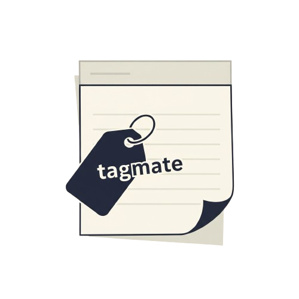

# Tagmate – Obsidian Folder/Tag Mapper

<p align="center">
  
</p>

**Plugin:** Tagmate  
**Author:** fitwithbytes

---

## What is Tagmate?

I couldn't find any Obsidian plugin that does exactly what I wanted: automatically map folders to tags, manage tags in YAML or inline, and provide a fast UI for mapping and cleaning up tags. So I created **Tagmate**.

## Features

- **Folder-to-Tag Mapping:**
  - Assign tags (with type: auto/yaml/inline) to files in specific folders.
  - Supports subfolders, filetype filters, and per-mapping enable/disable.
  - Optionally auto-tag new notes as you create them.
- **Remove Tags Once:**
  - Select a folder, filetypes, and tags to remove from matching files (one-time action).
  - Tag type selection for removal (auto/yaml/inline).
- **Rapid Entry UI:**
  - Quickly add filetypes and tags with keyboard (auto-focus, chip UI, type toggles).
- **Tag Normalization:**
  - Always displays tags with exactly one leading `#` (no matter how you enter them).
- **YAML & Inline Support:**
  - Tags can be added/removed from YAML frontmatter or inline in the note body.
- **Bulk Tagging:**
  - Tag all existing notes in mapped folders with one click.
- **Enable/Disable All:**
  - Quickly enable or disable all mappings at once.

## Why is this useful?

- Keep your notes organized by folder and tag structure.
- Clean up old or inconsistent tags in bulk.
- Automate tagging for new notes, or retroactively tag your vault.
- Flexible for workflows that use YAML, inline, or both.

## Status

This plugin is **not actively developed** – I only update it occasionally as needed. If you find it useful, feel free to use it as-is!

## Donate (Monero/XMR)

If Tagmate is valuable to you and you'd like to support its development, you can donate Monero (XMR) to:

```
8A6DPPwEWq3cDBPcsw9P9nFQYiAkXmKdvbkLHC1GhkbTT4yiQRnSwqi79t9Wbot2A9iWCQVW8bsVZ4KcHtqyTVh4KTdqfJ7
```

Why Monero? For privacy, net neutrality, and freedom – your support is anonymous and censorship-resistant.

---

**This project is not affiliated with or endorsed by Obsidian.**
